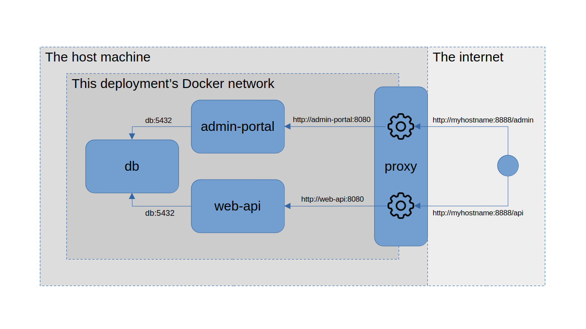
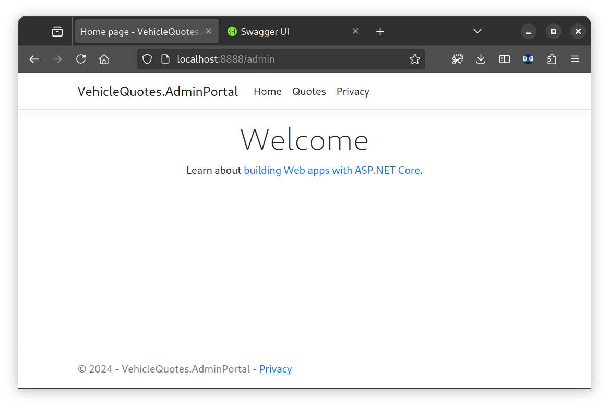
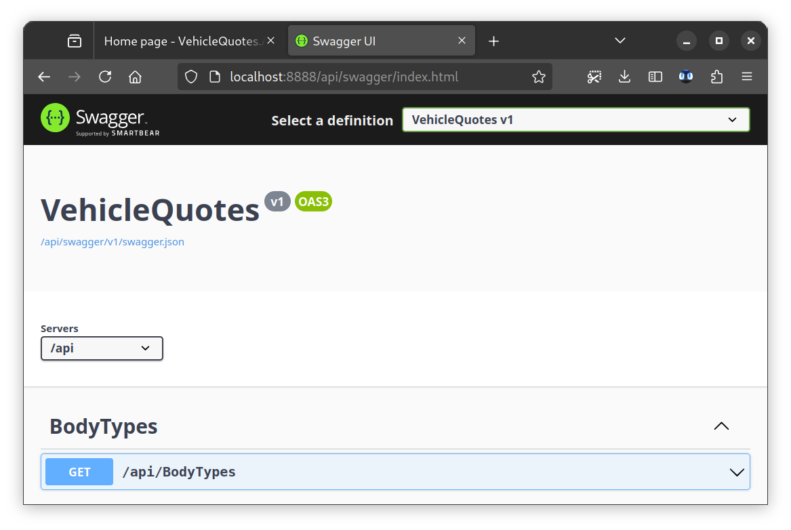
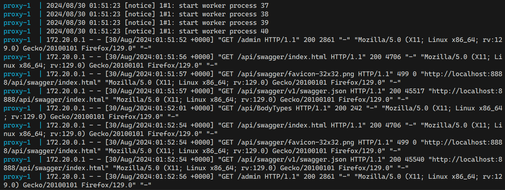

We recently [blogged](https://www.endpointdev.com/blog/2024/07/using-docker-compose-to-deploy-a-multi-application-dotnet-system/) about how we deployed a system made of multiple .NET applications using [Docker containers](https://www.docker.com/resources/what-container/). In order to make them accessible over the internet, we created a [reverse proxy](https://en.wikipedia.org/wiki/Reverse_proxy) using [Nginx](https://nginx.org/en/).

In that case, we installed and configured the Nginx instance directly in the server, as opposed to the rest of the applications, which ran within containers. That approach did and still does work well for us.

In this article, we're going to explore an alternative strategy. One where we push the containerization aspect further and deploy and run the Nginx instance itself in a Docker container.

## Reintroducing the demo project

Like I said, our system has multiple runtime components, each one of them running in their own container. We have two ASP.NET Core web applications: an Admin Portal and a Web API. They live in [this Git repository](https://github.com/megakevin/end-point-blog-dotnet-8-demo). And we also have a [Postgres](https://www.postgresql.org/) database, which the apps interact with.

We also have [another repository](https://github.com/megakevin/end-point-blog-dotnet-docker-deploy) where the deployment-related files are stored. Among others, there are the expected `compose.yaml` and `Dockerfile`s that describe the entire infrastructure.

Throughout this post we will update those deployment configuration files to add an Nginx reverse proxy.

Let's see what that would look like.

## Adding the proxy service in `compose.yaml`

First we need to add the new container in the `compose.yaml`'s `services` section. It doesn't need to be too complicated:

```yaml
# compose.yaml

services:

# ...

  proxy:
    # The proxy container will be based on this Dockerfile, which we'll define
    # soon.
    build:
      context: .
      dockerfile: Dockerfile.Proxy

    # Here we expose the Nginx proxy via port 8888. This can be anything. In
    # fact, if you want to do multiple parallel deployments on the same machine,
    # that is, with many Nginx instances running at the same time, you can
    # adjust this setting appropriately to prevent port conflicts. Making sure
    # that each instance has its own port.
    ports:
      - 8888:80

    # We want the proxy to start up after the admin-portal and web-api services
    # are up and running. The depends_on setting helps with that.
    depends_on:
      admin-portal:
        condition: service_started
      web-api:
        condition: service_started

#...
```

## Writing the proxy `Dockerfile`

As you saw, the `proxy` configuration in `compose.yaml` leverages an external `Dockerfile` to build the container image that will run our Nginx proxy. This file is also very straightforward. It uses [the official Nginx image from Dockerhub](https://hub.docker.com/_/nginx) and it looks like this:

```dockerfile
# Dockerfile.Proxy

# We can pick the version and flavor that we like. In our case here, this is an
# image based on the latest release of Nginx, and the latest release of Debian.
FROM nginx:1.27.1-bookworm

# Unsurprisingly, we have a custom configuration that we want the proxy to use.
# This is how we make sure it does. We copy it into the default location inside
# the image.
COPY proxy/nginx.conf /etc/nginx/nginx.conf
```

## Configuring the proxy

Now we have to configure the Nginx proxy to route requests to both our web applications. Here's an `nginx.conf` that does just that:

```sh
# proxy/nginx.conf

user  nginx;
worker_processes  auto;

error_log  /var/log/nginx/error.log notice;
pid        /var/run/nginx.pid;


events {
    worker_connections  1024;
}

http {
    include       /etc/nginx/mime.types;
    default_type  application/octet-stream;

    log_format  main  '$remote_addr - $remote_user [$time_local] "$request" '
                      '$status $body_bytes_sent "$http_referer" '
                      '"$http_user_agent" "$http_x_forwarded_for"';

    access_log  /var/log/nginx/access.log  main;

    sendfile        on;

    keepalive_timeout  65;

    # We have to comment out or remove this line to make sure the default
    # configuration that comes in the official image is not applied.
    # include /etc/nginx/conf.d/*.conf;

    # Our customizations start here:
    server {
        # With this listen directive, we configure our proxy to expect
        # connections coming from the default HTTP port: 80.
        listen 80;

        # This location directive makes sure all requests coming to URLs that
        # look like .../admin are routed to the Admin Portal web app.
        location ~ ^/admin(/?)(.*) {
            proxy_pass http://admin-portal:8080;
            proxy_http_version 1.1;
            proxy_set_header Host $host;
            proxy_set_header Connection keep-alive;
        }

        # This location directive makes sure all requests coming to URLs that
        # look like .../api are routed to the Web API.
        location ~ ^/api(/?)(.*) {
            proxy_pass http://web-api:8080;
            proxy_http_version 1.1;
            proxy_set_header Host $host;
            proxy_set_header Connection keep-alive;
        }
    }
}
```

What I've done here is take the default Nginx configuration file that comes right out of the box, and replace the `include /etc/nginx/conf.d/*.conf;` line with my own `server` block directive.

> As explained in [the official image's Dockerhub page](https://hub.docker.com/_/nginx), a quick way of obtaining a copy of this default file is using this command: `docker run --rm --entrypoint=cat nginx /etc/nginx/nginx.conf > /host/path/nginx.conf`.

The most interesting parts are the `proxy_pass` directives that take care of redirecting traffic to the apps. Notice how they refer to the Admin Portal using `http://admin-portal:8080` and to the Web API by `http://web-api:8080`. These are the internal naming of these components within the containers' virtual network, which gets created automatically by Docker Compose.

Remember that this Nginx instance is not running in the host machine directly. Instead it's running in a container. In the same virtual network as the other containers described in `compose.yaml`. That's why it has to use the hostnames assigned by `compose.yaml` (i.e. `admin-portal` and `web-api`) and the port through which the ASP.NET Core apps running within accept requests (i.e. `8080`).

This is the idea:



It also uses `proxy_set_header` directives to set `Host` and `Connection` headers. This is typical practice when it comes to Nginx reverse proxies. You can read more about that [here](https://docs.nginx.com/nginx/admin-guide/web-server/reverse-proxy/#passing-request-headers).

## Configuring the Path Base in ASP.NET Core apps

There's an additional step that we have to take to make all this work. We have configured our Nginx proxy to serve both applications under the same "server", and rely on different in URL paths (i.e. `/admin` vs `/api`) to determine which app will receive which request. This means that we have to perform further configuration in the apps so that routing is done properly. Thankfully, all it takes is a one-liner in each of the app's `Program.cs` file, after the usual `var app = builder.Build();` line, we do the following:

For the Admin Portal, we add this:

```csharp
// source/VehicleQuotes.AdminPortal/Program.cs

// ...

app.UsePathBase("/admin");

// ...
```

And for the Web API:

```csharp
// source/VehicleQuotes.WebApi/Program.cs

// ...

app.UsePathBase("/api");

// ...
```

With that, the apps are ready to handle requests coming from the Nginx proxy, which will include either the `/admin` or `/api` sections.

## Deploying

Finally, we can deploy. Go into the directory where all the deployment configuration files live. That's the one with the `compose.yaml` file. In other words, the root of [the deploy repo](https://github.com/megakevin/end-point-blog-dotnet-docker-deploy). Once in there, run:

```sh
docker compose up --build
```

After a while, Docker compose will have built and deployed everything for us. Now you can navigate to the apps in any browser at http://localhost:8888/admin and http://localhost:8888/api/swagger/index.html.





As you click around, you can see the Nginx logs with:

```sh
docker compose logs proxy -f
```



To bring it all back down, you can run:

```sh
docker compose down
```

Cool! At the end of the day, Nginx is just another program that runs as a process in an operating system. And as such, it can be run in a container. One of the nice aspects about this setup is the convenience of having an entire system described in a set of files, and being able to bring everything up with a single command.