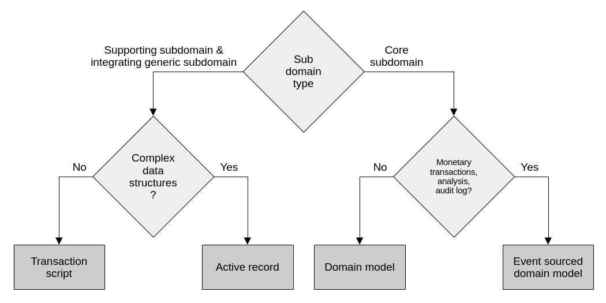
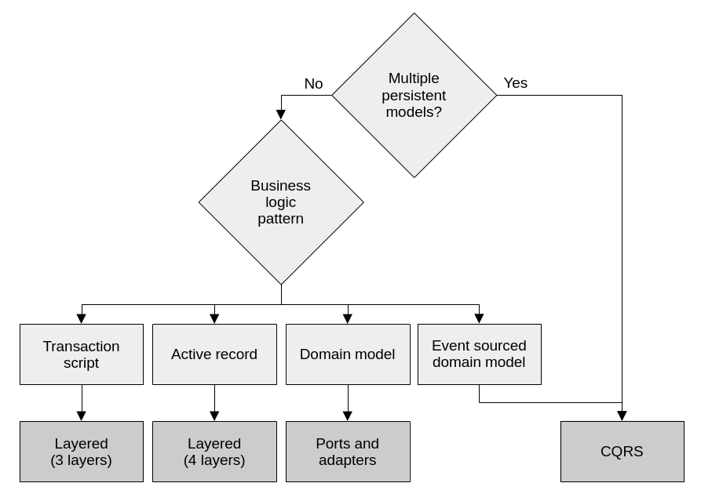
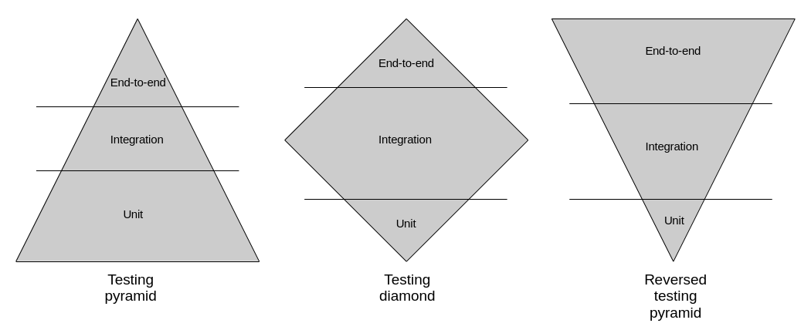
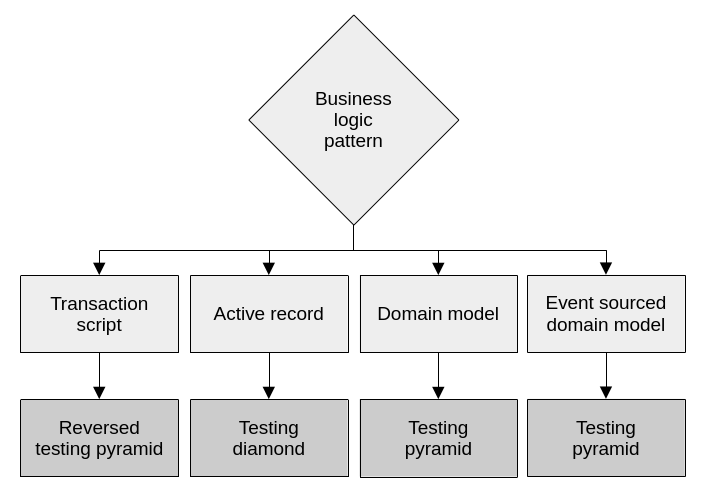

# Applying Domain-Driven Design in Practice

> This is part 4 of a series of blog posts on Domain-Driven Design:
>
> 1. [High level system analysis and design with Domain-Driven Design](https://www.endpointdev.com/blog/)
> 2. [Implementing business logic with Domain-Driven Design](https://www.endpointdev.com/blog/)
> 3. [Designing software architecture with Domain-Driven Design](https://www.endpointdev.com/blog/)
> 4. [Applying Domain-Driven Design in Practice](https://www.endpointdev.com/blog/)

**Domain-Driven Design** is an approach to software development that focuses on, [as Eric Evans puts it](https://www.oreilly.com/library/view/domain-driven-design-tackling/0321125215/), "tackling the complexity in the heart of software". And what is in the heart of software? The business domain in which it operates. Or more specifically: a **model** of it, made of code. That is, the code that implements the business logic that comes into play when solving problems within the realm of a particular business activity.

DDD is not just about writing code though. It's a whole methodology that touches on business needs, requirements gathering, organizational dynamics, high level architectural design, and lower level patterns for implementing software intensive systems.

As a result, DDD offers a treasure trove of concepts, patterns and tools that can be applied to any software project, regardless of the size and complexity.

In this series of blog posts we're going to explore many aspects of DDD. We will be following the structure laid out by [Vlad Khononov](https://vladikk.com/)'s excellent book on the topic "[Learning Domain-Driven Design: Aligning Software Architecture and Business Strategy](https://www.oreilly.com/library/view/learning-domain-driven-design/9781098100124/)". So you can think of this series as a summary of that book. An abridged version that can serve as a review for anybody who has read it; but also as an entry point for people who are new to DDD.

## Table of contents

## Section 10: Design heuristics

At this point in the series we've explored a number of tools and patterns to work with DDD. We also touched on what kinds of problems they solve and how to apply them. We learned how to analyze bunsiness domains, how to design high level components, how to implement business logic, how to organize code bases and how system components interact. In this section, we'll discuss a series of heuristics that we can use to make decissions as to when to apply them.

### Bounded contexts

When designing bounded contexts, that is, the physically separated system components, size is not a useful metric. Instead, consider the model that it contains, and make sure it's cohesive. In fact, breaking down a system into many bounded contexts too early is a form of premature optimization that can be costly when done wrongly. And at the beginning of a project, when domain knowledge is likely as low as it will ever be, it's easy to be wrong.

A system that's broken up in many physical components is more expensive to maintain because changes usually propagate across them. This is due to obvious technical reasons, but can also be exacerbated by organizational reasons. For example, when the bounded contexts are maintained by different teams.

So, start with bounded contexts with broader boundaries. And then, as the system matures and the team acquires more domain knowledge, refactor into separate system components when needed.

### Business logic implementation patterns

At its core, DDD is about letting the business domain drive software design decissions. This means that we should strive to use the right tool for the job. As we've discussed before, the level of complexity of the domain at hand is what determines which business logic implementation patterns should be applied. The more complex the problem at hand, the more elaborate the chosen pattern for the solution. Luckily, we learned that we can classify subdomains by their level of complexity. So we can use subdomain types to drive our decision making. This is explained in this diagram:

*Complexity, subdomain types and particular business requirements are what drive how we implement business logic.*

### Architectural patterns

Once we have decided how to implement the business logic, it's easy to decide which architectural pattern to develop our system with. The decission on what architecture to use is dependant on the business requirements and the business logic pattern we've selected:

*The architecture is driven by whether we need multiple models to represent the same data and the business logic pattern.*

If a system is using an event sourced domain model, or it needs multiple persistence models, CQRS is almost a requirement. Otherwise the system would be very limited in its querying capabilities. For a plain domain model, a ports and adapters architecture is ideal because it allows the domain model to be completely decoupled from data persistance concerns. For the active record pattern, it's best to go with a layered architecture that includes a service layer. The service layer orchestrates the active records to execute the business operations. Finally, a simple three-layered architecture is sufficient for transaction scripts, where no advanced abstractions are needed to accomoday complex business logic.

### Testing strategy

Generally, there are three kinds of automated tests: end-to-end, integration and unit tests. A test suite in any given system can choose to lean more into one kind and less on the others, forming one of three possible scenarios: the testing pyramid, diamond and reverse pyramid.

*A test suite can be imbalanced in terms of the kinds of tests that it implements. Depending on the kind of system that is being tested, it is often more valuable to have more tests of one kind and fewer of others.*

How does it choose? It does so based on the patterns that it uses for implementing its business logic and its architecture. Here's the decission tree:

*The patterns we chose for business logic and architecture, often give us a good idea of what kinds of tests should we focus more on.*

A domain model leans heavily on components that are testable as units. Plain old objects like aggregates and value objects can be very well covered in isolation by unit tests. Active records on the other hand, are tightly coupled with database interaction logic. In these cases, business logic is usually distributed between the active records themselves, the database, and service objects. Integration tests are the most appropriate kinds of tests for this type of system, as they exercise multiple layers at once, and how they interact. Finally, pure transaction script systems benefit more from end-to-end tests. This is because their abstractions are shallow, so the system components are often hard to decompose and test in a meaningful way. Also, their logic is simple, so tests that exercise entire workflows can be very effective.

## Section 11: Evolving design decisions

## Section 12: Domain-driven design in the real world
