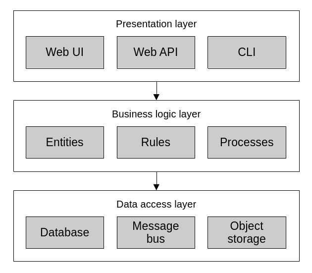
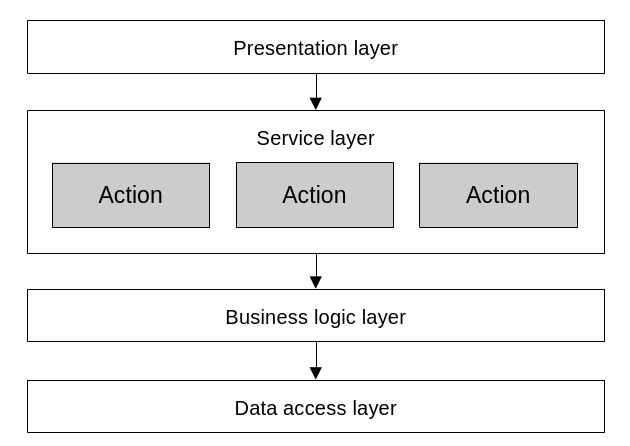
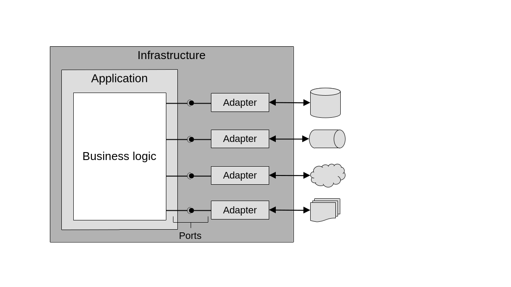
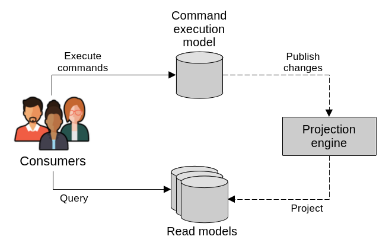
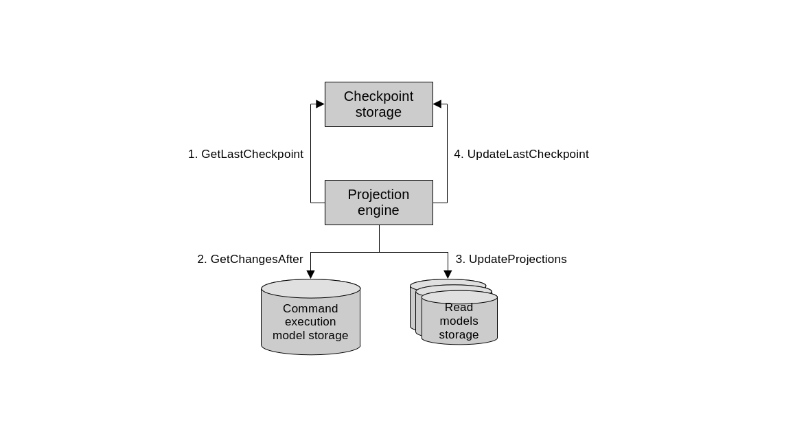
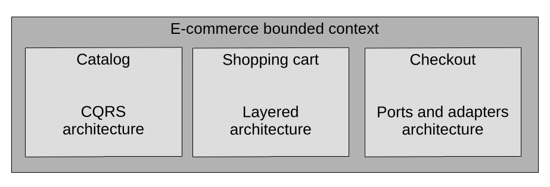

# Designing software architecture with Domain-Driven Design

> This is part 3 of a series of blog posts on Domain-Driven Design:
>
> 1. [High level system analysis and design with Domain-Driven Design](https://www.endpointdev.com/blog/)
> 2. [Implementing business logic with Domain-Driven Design](https://www.endpointdev.com/blog/)
> 3. [Designing software architecture with Domain-Driven Design](https://www.endpointdev.com/blog/)
> 4. [Blog post #4](https://www.endpointdev.com/blog/)

**Domain-Driven Design** is an approach to software development that focuses on, [as Eric Evans puts it](https://www.oreilly.com/library/view/domain-driven-design-tackling/0321125215/), "tackling the complexity in the heart of software". And what is in the heart of software? The business domain in which it operates. Or more specifically: a **model** of it, made of code. That is, the code that implements the business logic that comes into play when solving problems within the realm of a particular business activity.

DDD is not just about writing code though. It's a whole methodology that touches on business needs, requirements gathering, organizational dynamics, high level architectural design, and lower level patterns for implementing software intensive systems.

As a result, DDD offers a treasure trove of concepts, patterns and tools that can be applied to any software project, regardless of the size and complexity.

In this series of blog posts we're going to explore many aspects of DDD. We will be following the structure laid out by [Vlad Khononov](https://vladikk.com/)'s excellent book on the topic "[Learning Domain-Driven Design: Aligning Software Architecture and Business Strategy](https://www.oreilly.com/library/view/learning-domain-driven-design/9781098100124/)". So you can think of this series as a summary of that book. An abridged version that can serve as a review for anybody who has read it; but also as an entry point for people who are new to DDD.

## Chapter 8: Architectural patterns

Now that we've seen various patterns for implementing business logic, i.e. "the heart of software". We turn our attention to architecture.

Indeed, the business logic is the raison d'être for a software application. But applications have other responsibilities that are also important. Like interacting with users, receiving requests and returning results, storing data, interfacing with external services. In order to balance all these concerns and make sure the code base does not devolve into an unmaintainable big ball of mud, we need to be intentional in how we organize it. We need to design its architecture.

That is, the rules and principles that we follow to organize the various aspects of code base and create clear boundaries between them. In essence, defining the system's big logical components, their dependencies and interactions.

In this section we will see three common architectural patterns: layered architecture, ports and adapters, and command query responsibility segregation.

### Layered Architecture

The **layered architecture** is one of the most common architectural patterns out there. It has been present, in one form or another, for a long time. The main idea of the pattern is to separate applications into three layers: the presentation layer, the business logic layer, and the data access layer.


*Layered architecture.*

The **presentation layer** (or user interface layer) is meant to implement the mechanisms through which consumers interact with the application. This means the app's graphical user interface (GUI), command line interface (CLI) or application programming interface (API).

The **business logic layer** (or domain layer) implements the business rules, validation and invariants. This is where we'd implement the patterns that we've seen so far like transaction script, active record, or a domain model.

Sometimes, an additional "**service layer**" or "**application layer**" emerges between the presentation and business logic layers. When the domain logic needs some level of orchestration, such as it is the case with active records and domain models, it is often useful to further separate the presentation and business logic layers by exposing a sort of "public interface" to the domain. That is, a series of procedures (i.e. transaction scripts) that serve as a facade that maps presentation layer actions (e.g. user interactions) to business domain transactions.


*The service layer sits between the presentation and business logic layers. It implements a series of actions which map closely to the operations exposed to users by the presentation layer.*

Here's an example of refactoring a "fat" controller by introducing a service layer:

```csharp
// This is an MVC controller that implements a REST API endpoint for adding
// items to a shopping cart. It lives in the application's presentation layer
// and leverages business logic layers component to run.

namespace MvcEcommerce.WebApi.Controllers;

[Route("api/[controller]")]
[ApiController]
public class QuoteItemsController : ControllerBase
{
    // ...

    // This action takes care of processing user input, fetching HTTP context
    // values like cookies, responding with proper HTTP status codes and
    // orchestrating the business logic.
    [HttpPost]
    public async Task<ActionResult> Post([FromBody] QuoteItemPost payload)
    {
        var quoteId = _quoteCookieManager.GetQuoteIdFromCookie(Request);
        var quote = await _quoteRepository.FindOpenByIdAsync(quoteId);
        if (quote == null) return NotFound("Quote not found");

        var product = await _productRepository.FindByIdAsync(payload.ProductId);
        if (product == null) return NotFound("Product not found");

        var matchingQuoteItem = quote.GetItemBy(productId: payload.ProductId);
        if (matchingQuoteItem != null) return BadRequest("Item already exists");

        var quoteItem = new QuoteItem()
        {
            Product = product,
            Quantity = payload.Quantity,
        };
        quote.Items.Add(quoteItem);

        await _quoteRepository.UpdateAsync(quote);

        return Ok(quoteItem);
    }
}
```

This controller does too much. We can move a lot of its logic into a service layer component:

```csharp
namespace MvcEcommerce.WebApi.Controllers;

[Route("api/[controller]")]
[ApiController]
public class QuoteItemsController : ControllerBase
{
    // ...

    // Thanks to refactoring, this action is now much simpler and only concerned
    // with presentation layer issues. That is, handling user input and the HTTP
    // specific aspects of request processing. It relies on the service layer to
    // orchestrate the business logic.
    [HttpPost]
    public async Task<ActionResult> Post([FromBody] QuoteItemPost quoteItem)
    {
        try
        {
            var quoteId = _quoteCookieManager.GetQuoteIdFromCookie(Request);

            var result = await _quoteItemCreator.Run(new() {
                QuoteId = quoteId.Value,
                ProductId = quoteItem.ProductId,
                Quantity = quoteItem.Quantity
            });

            return Ok(result);
        }
        catch (EntityNotFoundException ex)
        {
            return NotFound(new ErrorMessage(ex));
        }
        catch (DomainException ex)
        {
            return BadRequest(new ErrorMessage(ex));
        }
    }
}
```

```csharp
// This service object implements all the domain logic orchestration logic that
// used to live in the controller. Notice how this code is not concerned with
// presentation layer responsibilities like handling HTTP specific logic, for
// example.

namespace MvcEcommerce.ServiceLayer.Services;

public class QuoteItemCreator
{
    // ...

    public async Task<QuoteItem> Run(InputPayload payload)
    {
        var product =
            await _productRepository.FindByIdAsync(payload.ProductId) ??
                throw new EntityNotFoundException("Product not found");

        var quote =
            await _quoteRepository.FindOpenByIdAsync(payload.QuoteId) ??
                throw new EntityNotFoundException("Quote not found");

        var matchingQuoteItem = quote.GetItemBy(productId: payload.ProductId);
        if (matchingQuoteItem != null)
            throw new DomainException("Item already exists");

        var quoteItem = new QuoteItem()
        {
            Product = product,
            Quantity = payload.Quantity,
        };
        quote.Items.Add(quoteItem);

        await _quoteRepository.UpdateAsync(quote);

        return quoteItem;
    }
}
```

Finally, the **data access layer** is meant to provide the means of interacting with persistent storage like databases, search indexes, file systems, etc. In modern systems, this layer has evolved into more of a "infrastructure" layer, and taken on the responsibility of interacting with external APIs and other kinds of web services. So, not strictly limited to pure "data storage".

The communication between these layers is one-way, from top to bottom. Meaning that the presentation layer holds a reference to, depends on, and calls to the business logic layer. Same with the business logic layer to the data access layer.

This communication pattern is excellent for active record and transaction script based systems. For domain models, it begins to fall a bit short. This is because the business logic depending on the data access logic contradicts one of the core principles of domain models: the fact that they are supposed to be plain old objects, with no dependencies on frameworks or infrastructure.

### Ports and Adapters

The **ports and adapters architecture** leverages the dependency inversion principle to address the shortcomings of the traditional layered architecture and make it ideal for implementing domain models. Its main advantage is that it decouples the business logic layer from the infrastructure.

The [**dependency inversion principle**](https://en.wikipedia.org/wiki/Dependency_inversion_principle) dictates that, instead of higher level components depending on, referencing, and calling lower level ones; it is the lower level components that should depend on the higher level ones. This is done by the higher level components defining contracts for the lower level components to implement, and through those, be integrated into the higher level components' workflows. The higher level components only ever interact with the lower level ones through the contracts that they themselves define.

Case in point: instead of the business logic depending on data access logic, like in the layered architecture; the business logic layer takes center stage and defines the contracts that the data access layer (and really, all infrastructure) must abide to in order to be usable to the business logic.

And that's precisely where the ports and adapters name comes from. The business logic defines contracts/interfaces, AKA "ports"; and the infrastructure has concrete implementations of these interfaces: the "adapters". Then, application bootstrapping logic, or [**dependency injection**](https://en.wikipedia.org/wiki/Dependency_injection), take care of supplying the concrete objects (or adapters) to the abstract interfaces (or ports) that the business logic specifies. This is exactly what a domain model calls for.

Here's an example of a minimal, thin vertical slice of an application designed using the ports and adapters pattern:

The business logic implements some procedure which necessitates interacting with the database, an email delivery service, and a payment processor:

```csharp
namespace Ecommerce.BusinessLogicLayer.Services;

public class OrderCreator
{
    // This service does not directly depend on concrete classes. Instead, it
    // references abstract interfaces. The concrete implementations are given
    // via dependency injection through the constructor.
    private readonly IOrderRepository _orderRepository;
    private readonly IOrderConfirmationMailer _orderConfirmationMailer;
    private readonly IPaymentGateway _paymentGateway;

    public OrderCreator(
        IOrderRepository orderRepository,
        IOrderConfirmationMailer orderConfirmationMailer,
        IPaymentGateway paymentGateway
    ) {
        _orderRepository = orderRepository;
        _orderConfirmationMailer = orderConfirmationMailer;
        _paymentGateway = paymentGateway;
    }

    public async Task<Order> Run(InputPayload payload)
    {
        // ...

        var order = new Order(payload);

        var result = _paymentGateway.SubmitPayment(order);
        if (!result.IsSuccess)
            throw new DomainException("Error processing payment");

        await _orderRepository.Save(order);

        await _orderConfirmationMailer.Send(order);

        return order;
    }
}
```

The business logic layer also defines its ports. That is, interfaces that the infrastructure layer will have to implement:

```csharp
namespace Ecommerce.BusinessLogicLayer.Interfaces;

public interface IPaymentGateway
{
    PaymentTransactionResult SubmitPayment(Order order);
}

public interface IOrderRepository
{
    Task<Order> Save(Order Order);
}

public interface IOrderConfirmationMailer
{
    Task Send(Order order);
}
```

The infrastructure layer provides implementations for these interfaces:

```csharp
namespace Ecommerce.InfrastructureLayer.Payments;

public class AuthorizeNetPaymentGateway : IPaymentGateway
{
    public AuthorizeNetPaymentGateway(/* ... */) { /* ... */ }

    public PaymentTransactionResult SubmitPayment(Order order) { /* ... */ }
}
```

```csharp
namespace Ecommerce.InfrastructureLayer.Repositories;

public class OrderRepository : IOrderRepository
{
    public OrderRepository(/* ... */) { /* ... */ }

    public Task<Order> Save(Order Order) { /* ... */ }
}
```

```csharp
namespace Ecommerce.InfrastructureLayer.Mailers;

public class OrderConfirmationAwsSesMailer : IOrderConfirmationMailer
{
    public OrderConfirmationAwsSesMailer(/* ... */) { /* ... */ }

    public Task Send(Order order) { /* ... */ }
}
```

Like mentioned before, everything can be wired together via dependency injection or some other form of bootstrapping. Most frameworks have their own way of resolving dependencies and instantiating service objects like these; in order to execute them as a result of requests from consumers (e.g. a CLI command, a web request, the click of a button). In essence, it's something like this:

```csharp
var repository = new OrderRepository(dbContext);
var mailer = new OrderConfirmationAwsSesMailer(mailerConfig);
var paymentGateway = new AuthorizeNetPaymentGateway(paymentConfig);

var orderCreator = new OrderCreator(repository, mailer, paymentGateway);

orderCreator.Run(payload);
```

So, the ports and adapters architectural pattern has a **business logic layer** which has no dependencies on any other components outside of itself. It defines a set of interfaces for all external components that want to interact with it. It also has an **infrastructure layer** which implements concrete classes for the domain layer's interfaces. Data access, interaction with external services, and user interface and presentation logic all live here. And finally, it has a **service/application layer** which, similar to its counterpart from the layered architecture, can emerge between the business logic and infrastructure layers when needed to expose a set of procedures that closely map to user interface actions. It exposes all the business operations that the system supports and orchestrates the business logic to carry them out.


*When organizing the code following the the ports and adapter architectural pattern, the business logic layer defines interfaces/ports, which the infrastructure layer implements concrete objects for. These objects take care of interacting with the external world.*

Clean architecture, onion architecture and hexagonal architecture are all different names for the same core concepts and principles espoused by ports and adapters; sometimes with slight variations depending on the particular flavor and tech stack.

### Command Query Responsibility Segregation

The **command query responsibility segregation pattern** (CQRS) builds on the principles from ports and adapters and adds support for multiple different representations of the system's data. That is, having multiple persistence models for the same data set. One of the most common examples is a system that stores and operates on day to day business transactions using an OLTP ([online transaction processing](https://en.wikipedia.org/wiki/Online_transaction_processing)) representation, but also needs to provide an OLAP ([online analytical processing](https://en.wikipedia.org/wiki/Online_analytical_processing)) data warehouse for high level business analysis. One ground-truth source of data (the OLTP) is used to produce additional representations with a different schema (the OLAP). CQRS enables this.

As such, CQRS is ideal for event sourced domain models, because it allows persisting the many projections of an aggregate's data into their own databases. (Remember that in the context of event sourcing, a projection is a representation of the state of a business entity which is constructed based on its stored domain events). It allows of course, querying of these projections with much more flexibility than an event store allows.

At the core of CQRS there are two types of models: a command execution model (the C in CQRS) and one or many read, or query, models (the Q in CQRS). In database terms, this is similar to a [**primary-replica**](https://en.wikipedia.org/wiki/Master%E2%80%93slave_(technology)) type of situation, where the command execution model represents the primary, and the read models represent the replicas.


*CQRS exposes two types of models, one for executing commands and many others for reading. In the backend, a projection engine keeps the read models up to date with the latest changes from the command execution model.*

The **command execution model** is the system's source of truth, whose data is strongly consistent. It's the one used to execute and record business operations, and enforce business rules and invariants. All operations that result in changes to the system state are handled here.

The **query, or read, models** take care of exposing different projections of the system state. These are read-only models that are meant for presenting the system's data to its consumers. They are generated based on the main data source, which is the data maintained in the command execution model. In fact, read models should be capable of being easily destroyed and recreated from the main data.

Read models are generated using components that we call **projection engines**, which can work synchronously or asynchronously when fetching data from the command execution models to generate their projections.

Synchronously, projection engines generate read models using a **catch-up subscription** design. It works like this:

1. The projection engine determines the last query checkpoint. Basically, when was the last time it read the main database.
2. The projection engine queries the main database and identifies newly added and updated records since the last query checkpoint.
3. The projection engine uses the new data to regenerate or update the read model.
4. The projection engine updates the latest query checkpoint, to be used during the next execution of the engine, starting again at step 1.


*Synchronous projection engine.*

This checkpoint can be implemented in various ways. The main idea is to offer a mechanism for the projection engine to be able to tell which records are new or have changed since the last run. One way to do it is using something akin to SQL Server's [**rowversion**](https://learn.microsoft.com/en-us/sql/t-sql/data-types/rowversion-transact-sql?view=sql-server-ver17) feature. This is a database-wide, auto-incrementing numeric value that increases after every INSERT and UPDATE operation. The newly incremented value is assigned to the rows that were added or updated. With this, the projection engine can easily query all records whose rowversion is greater than the last checkpoint. Similar functionality can be implemented using database triggers too. Or database tables can also include **timestamp** fields that indicate when records were last touched.

Asynchronous projection engines on the other hand, rely on the command execution model publishing all changes to a **message bus**. The projection engine can subscribe to these messages and updates its read model as they come. This method, while scalable, comes with drawbacks inherent to distributed computing like handling duplicates and out of order messages. It's also more difficult to destroy and regenerate read models that rely on asynchronous messaging only, since the messages are gone after they are processed. Often the better solution is to use a synchronous design and then, only if needed, augment it with the asynchrony.

Naturally, CQRS is ideal when the system needs to support data in different databases. Imagine an online store, which has an inventory management component that works directly with the command execution model backend by a relational database. But for displaying the catalog to users, it uses a read model backed by a search index, optimized for full text search. And for event sourced domain models, CQRS is practically mandatory.

### Scope

The patterns that we've seen in this section are not exclusively meant as system-wide nor even bounded-context-wide organizational principles. Arbitrarily enforcing a single pattern everywhere often leads to accidental complexity. Instead we should follow DDD's core principles and deploy these strategies according to what the business domain necessitates. Indeed, within a bounded context, especially one that deals with many subdomains, these should be logical separation between these subdomains. Each resulting module could use a different architectural pattern. In other words, these patterns divide the code base into horizontal slices; and the subdomains can be used to define the vertical slices. This way, a monolithic bounded context can be modularized. This leaves the code base in a good position for future refactoring and further physical separation into distinct bounded contexts in the future (i.e. into separate applications, services and/or processes).


*When needed, different architectural patterns can be deployed to different subdomains within the same bounded context.*
